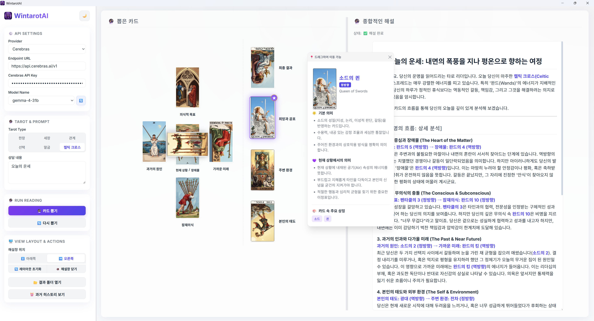

# 🔮 WintarotAI



**WintarotAI**는 프리미엄 AI 기반 데스크톱 타로 리딩 애플리케이션입니다. 카드를 섞고 다양한 스프레드로 배치하여 개별 카드의 세부 의미를 탐색할 수 있으며, 고성능 로컬 및 클라우드 거대언어모델(LLM)을 통해 깊이 있고 개인화된 실시간 타로 해설과 가이드를 제공받을 수 있습니다.

WintarotAI를 사용하면 인생, 커리어, 연애 등 다양한 질문에 대해 스프레드를 선택하고 카드를 뽑아, 우주의 에너지를 분석하는 AI 타로 리더의 실시간 조언을 들어볼 수 있습니다.

---

## ✨ 주요 특징

- **78장의 라이더-웨이트-스미스 덱을 현대적으로 재해석한 덱**
  - 22장의 메이저 아르카나와 56장의 마이너 아르카나(완드, 컵, 소드, 펜타클) 지원.

- **스프레드 프리셋**
  - **한 장 뽑기**: 오늘 하루의 흐름이나 빠른 데일리 가이드를 제공합니다.
  - **세 장 뽑기**: 과거, 현재, 미래의 시간적 흐름에 따른 상황을 분석합니다.
  - **관계 스프레드**: 나와 상대방의 심리 및 관계 상황을 비교 분석(5장)합니다.
  - **선택 스프레드**: 두 가지 선택지(양자택일)의 흐름과 예상 결과를 비교(5장)합니다.
  - **말굽 스프레드 (Horseshoe)**: 상황의 전체적인 흐름과 해결 행동 지침을 심층 분석(7장)합니다.
  - **켈틱 크로스 (Celtic Cross)**: 상황의 원인부터 내면적 심리, 장애물, 미래, 최종 결과까지 10장의 카드로 가장 입체적인 심층 분석을 제공합니다.

- **인터랙티브 카드 상세 팝업**
  - 뽑은 카드를 클릭하면 드래그하여 이동 가능한 상세 설명 패널이 열립니다.
  - **기본 의미** 및 현재 상황에서의 의미(정방향/역방향 포함)를 카드 일러스트와 함께 제공합니다.
  - 팝업의 카드를 클릭하면 확대된 이미지와 함께 의미와 상징에 대한 자세한 설명이 표시됩니다.

- **심층 AI 리딩 및 실시간 스트리밍**
  - 질문 내용에 맞춤화된 깊이 있는 타로 해석이 실시간 스트리밍으로 작성됩니다.
  - 리딩이 끝나면 핵심 결론 및 조언이 하단의 전용 **조언(Advice)** 배너에 강조되어 한눈에 파악할 수 있습니다.

- **유연한 뷰 레이아웃 및 제어 패널 (사이드바 통합)**
  - **해설창 위치 선택**: 화면 구성에 맞게 해설창을 아래쪽(`⬇️ 아래쪽`) 또는 오른쪽(`➡️ 오른쪽`)으로 배치할 수 있습니다.
  - **해설창 열기/닫기**: 해설창을 닫아 뽑은 카드 판을 화면에 꽉 차게 확장하여 카드 배치에 집중할 수 있습니다.
  - **레이아웃 초기화**: 클릭 한 번으로 해설창 위치와 크기(스플리터 크기), 열림 상태를 기본값으로 되돌립니다.
  - **결과 폴더 열기 & 히스토리 보기**: 사이드바 하단 버튼을 통해 간편하게 결과 저장 디렉토리를 열거나 과거 히스토리를 불러올 수 있습니다.

- **강력한 API 프로바이더 연동**
  - 개인정보 보호와 오프라인 실행을 위해 로컬 **LM Studio** 또는 **Ollama**를 연동할 수 있습니다.
  - 고성능 연동을 위해 **Google Gemini API**, **Ollama Cloud**, **OpenCode Go**, **OpenCode Zen**, **Cerebras** 등 다양한 클라우드 API를 독립된 키 저장 방식으로 지원합니다.

---

## 🚀 시작하기

### 📥 Download
최신 버전은 [Releases Page](https://github.com/kirinonakar/WintarotAI/releases)에서 다운로드 받을 수 있습니다.

### 준비 사항
- [Node.js](https://nodejs.org/) (v18 이상)
- [Tauri CLI](https://tauri.app/) (데스크톱 앱으로 컴파일하거나 실행할 경우)

### 설치 및 실행 방법
1. 의존성 패키지를 설치합니다:
   ```bash
   npm install
   ```
2. 개발 모드로 애플리케이션을 구동합니다:
   ```bash
   npm run dev
   ```
3. 프론트엔드 정적 소스를 빌드하려면:
   ```bash
   npm run build
   ```
4. Tauri를 사용하여 데스크톱 애플리케이션 빌드를 제작하려면:
   ```bash
   npm run tauri build
   ```

---

## 📄 라이선스

이 프로젝트는 [MIT License] 하에 배포됩니다. 자세한 내용은  [LICENSE](LICENSE) 파일을 참고해 주세요.